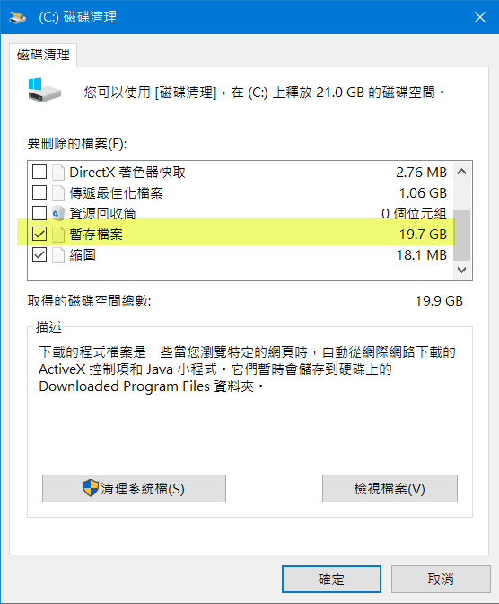
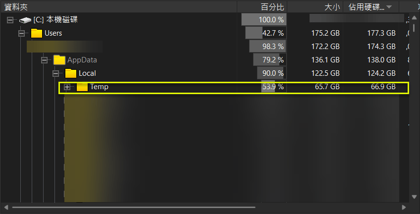
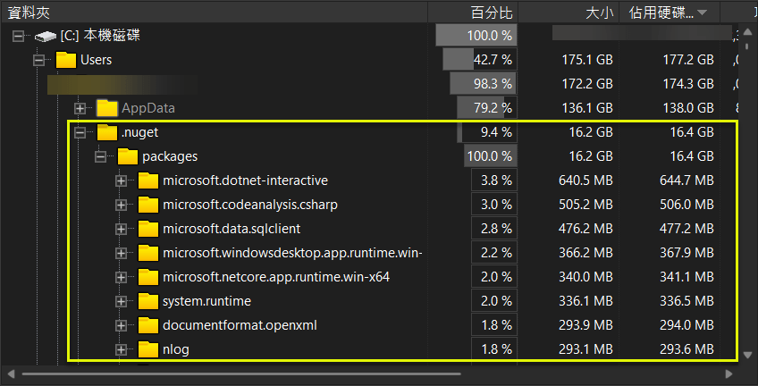
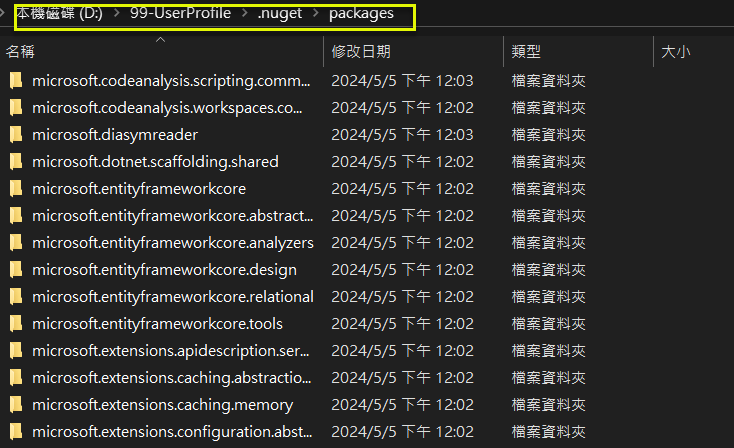

# 修改 nuget 的 globalPackagesFolder 設定, 以避免佔用系統磁碟 (C:) 的空間
## How to change the default nuget packages folder for saving disk space of C:

## 前言

由於最近 C: 磁碟機的空間所剩不多, 用 Windows 10 內建的磁碟清理, 它指出 %Temp% 資料夾佔了 19.7GB, 但實際清理, 卻永遠都清不掉.  

查了一下黑暗執行縮的三篇文章 (連結如參考文件), 有提到一個 WizTree 的工具, 可用以分析一下磁碟的使用狀況.  

結果嚇了一跳, 居然是 66.9GB, 遠比磁碟清理呈現的佔用空間值, 足足多了3倍. 實在不清楚原因. 最近沒安裝什麼軟體, 只有作了 Windows Update, 然後有更新失敗的狀況. 但剛剛去查更新記錄, 居然只有留下成功的, 失敗的記錄通通消失了. 真的很怪異.  
按理應該要寫一支 C# 程式定期清理 %Temp% 資料夾下 1 個月前的檔案及資料夾, 但還是有點擔心誤刪. 先暫緩.  

另外, 發現 %UserProfile%\.nuget\packages 佔了 16.4GB, 有找到 <a href="https://dev.to/tombohub/how-to-change-default-nuget-packages-folder-on-windows-51hb" target="_blank">How to change default Nuget packages folder on Windows</a> 的文章, 就來實際演練一下吧.  
<!-- more -->

[圖1] 磁碟清理  
  

[圖2] WizTree (%Temp%)  
  

[圖3] WizTree (%UserProfile%\.nuget\packages)  
  

## 作法

1.. 關掉所有的 Visual Studio 20XX  

2.. 建立資料夾  
D:\99-UserProfile\\.nuget\packages  

3.. 修改 %APPDATA%\NuGet\NuGet.config  

&lt;config&gt;  
    &lt;add key="globalPackagesFolder" value="D:\99-UserProfile\\.nuget\packages" /&gt;  
&lt;/config&gt;  

```xml
<?xml version="1.0" encoding="utf-8"?>
<configuration>
  <packageSources>
    <add key="nuget.org" value="https://api.nuget.org/v3/index.json" protocolVersion="3" />
    <add key="Microsoft Visual Studio Offline Packages" value="C:\Program Files (x86)\Microsoft SDKs\NuGetPackages\" />
  </packageSources>
  <!-- ~~~ -->
  </disabledPackageSources>
  <config>
    <add key="globalPackagesFolder" value="D:\99-UserProfile\.nuget\packages" />
  </config>
</configuration>
```

4.. 檢查設定  
命令列格式:  
 dotnet nuget locals <all | http-cache | global-packages | temp | plugins-cache> [--clear | -c | --list | -l]  

確認有改設到 D:\99-UserProfile\\.nuget\packages  
```
PS D:\Temp> dotnet nuget locals all --list
http-cache: C:\Users\user01\AppData\Local\NuGet\v3-cache
global-packages: D:\99-UserProfile\.nuget\packages
temp: C:\Users\user01\AppData\Local\Temp\NuGetScratch
plugins-cache: C:\Users\user01\AppData\Local\NuGet\plugins-cache
```

5.. 找一個先前寫的範例還原一下 nuget packages ( <a href="https://www.jasperstudy.com/2024/04/aspnet-core-8-web-api-oracle-swagger.html" target="_blank">ASP.NET Core 8 Web API 使用 Oracle.EntityFrameworkCore 存取 Oracle, 並使用 Swagger/OpenAPI 工具進行測試</a> )  

[圖4] 在 Visual Studio 2022 開啟方案檔, 它會自動進行 還原 Nuget 套件  
  

[圖5] 確認真的有還原 Nuget 套件到 D:\99-UserProfile\\.nuget\packages 資料夾下  
  

6.. 將 %UserProfile%\.nuget\packages 複製到 D:\99-UserProfile\\.nuget\packages  

7.. 刪除 %UserProfile%\.nuget\packages 的子資料夾  

## 2024.05.10 補充

### 如果有使用 LINQPad ...

如果有使用 LINQPad, 請設定 NUGET_PACKAGES 環境變數.   
經實測, 看來 LINQPad 不會使用 %APPDATA%\NuGet\NuGet.config  的設定.  

```powershell
D:\Temp>echo %NUGET_PACKAGES%
D:\99-UserProfile\.nuget\packages
```

## 參考文件

* <a href="https://blog.darkthread.net/blog/about-appdata-local-temp/" target="_blank">(黑暗執行緒) Windows AppData\Local\Temp 暫存檔二三事</a>  
* <a href="https://blog.darkthread.net/blog/disk-space-analysis-sop/" target="_blank">(黑暗執行緒) 分析 Windows 磁碟空間不足的正確姿勢</a>  
* <a href="https://blog.darkthread.net/blog/winsxs-cleanup/" target="_blank">(黑暗執行緒) C 碟空間不足案例 - WinSxs 清理經驗一則</a>  
* <a href="https://dev.to/tombohub/how-to-change-default-nuget-packages-folder-on-windows-51hb" target="_blank">How to change default Nuget packages folder on Windows</a>  


